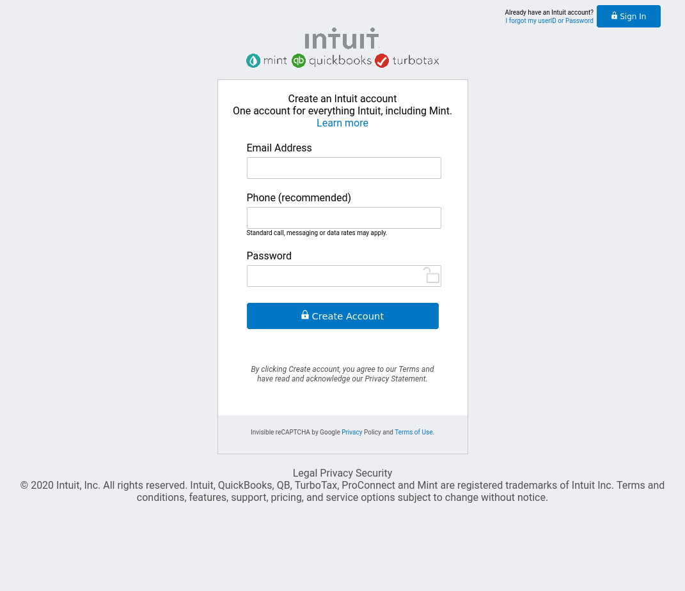

# Sign Up Page

> This is second project in main Microverse curriculum.
> This is the clone of Intuit Sign Up page.
> This is single page web site.
## Explanation
> This is the second project in the Microverse main curriculum. It is a clone of the original Mint's Sign Up page. 
> We used Html and CSS for page layout. This branch includes a project index file and styles.
[this is the original page](https://accounts.intuit.com/signup.html)

> You can chek out original page and compare to ours.

## Built With
Html
Css

## Live Demo

[Live Demo Link](https://zdrale.github.io/loginform/)

## Authors

👤 **Sinan Sevgi**

- GitHub: [@githubhandle](https://github.com/sinansevgi)
- LinkedIn:[LinkedIn](https://www.linkedin.com/in/sinan-s-52559437/)
- Twitter: [Twitter](https://twitter.com/nativeofcybers1)

👤 **Nikola Zdrale**

- GitHub: [@githubhandle](https://github.com/zdrale)
- LinkedIn:[LinkedIn](https://www.linkedin.com/in/nikola-zdrale)
- Twitter: [Twitter](https://twitter.com/zdralenikola)

## Show your support

Give a ⭐️ if you like this project!

## 📝 License

This project is [MIT](lic.url) licensed.
